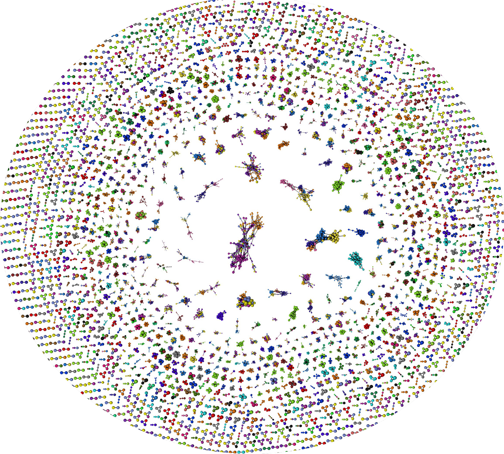

<table>
<tr>
<td>

# FastLTR framework

A framework for **de novo discovery, clustering, and classification of LTR retrotransposons**, building on Myers' FasTAN and FastLTR (https://github.com/thegenemyers/FASTAN)

Given a genome (FASTA/.1seq), detects repeat elements, cluster, builds a consensus sequence for each, and classifies them, producing
a TE consensus library suitable for annotation, alongside intermediate outputs including clusters and family phylogenies.

</td>
<td width="220">

</td>
</tr>
</table>

---

```
   GENOME (.fasta/.1seq)
      │
  ┌───▼───────────────────────────────────────────────┐
  │ 1. TANDEM COMPRESSION      FasTAN + taco          │  
  │    compress tandem arrays to one copy each        │  --tandem-rounds N
  └───┬───────────────────────────────────────────────┘
      │  TACO tandem-deleted genome (+ SALSA coordinate maps)
  ┌───▼───────────────────────────────────────────────┐
  │ 2. LTR DETECTION           FastLTR                │
  │    find LTR-retrotransposon copies.               │  (--rounds N)
  └───┬───────────────────────────────────────────────┘
      │  extracted element sequences (5'LTR / internal / 3'LTR / flanks)
  ┌───▼───────────────────────────────────────────────┐
  │ 3. CLUSTERING      k-mer seed + WFA               │
  │ families → subfamily split → consensus sequences  │
  └───┬───────────────────────────────────────────────┘
      │  consensi.fasta
  ┌───▼───────────────────────────────────────────────┐
  │ 4. CLASSIFICATION          TEsorter               │
  └───────────────────────────────────────────────────┘
             │
        classified TE consensus library (.fasta)
```


### 1. Tandem compression

Iterates:
- **FasTAN** tandem repeat detector
- **taco** keeps just **one copy** of each tandem array, and **salsa**
  writes a reversible coordinate map (`.1taco`) so any coordinate can be lifted back
  to the original genome.

`--tandem-rounds N` repeats (FasTAN → taco/salsa) iteratively, in order to delete nested tandem structures. 

### 2. LTR detection

```
   ...===LTR===[ internal body ]===LTR===...
```

With `--rounds N`, confidently classified LTR families are collapsed out of the
genome (via **taco/salsa**) and detection is re-run, exposing elements that were previously nested, allowing for their clustering.

### 3. Clustering & consensus building

Similarity graph is built with LTR-RT instances as nodes, edges constructed if LTRs wavefront align to 80% identity, and internal sequence also passes 80/80/80 rule.
**Families** are the connected components of that graph (with >=3 elements).

**Consensus** is built per family by **progressive, UPGMA-style profile merging with outgroup correction** to handle transitivity issues due to the 80/80/80 rule.

**Classification** is done using TEsorter to confirm presence of LTR-RT protein domains (https://github.com/zhangrengang/TEsorter)

## Install / build

### Singularity

**Installation:**
`singularity pull fastltr.sif docker://ghcr.io/anantmaheshwari/fastltr_framework:latest`

```bash
export SINGULARITY_DOCKER_USERNAME=<your-github-username>
export SINGULARITY_DOCKER_PASSWORD=<your-read:packages-PAT>
singularity pull fastltr.sif docker://ghcr.io/anantmaheshwari/fastltr_framework:latest
```

**Execution:**
`singularity exec fastltr.sif fastltr --genome genome.fa --rounds 10`

The image carries TEsorter, hmmer and BLAST.

### From source

```bash
# 1. Python >= 3.11
python3.11 -m venv env
source env/bin/activate
pip install -r requirements.txt
make            
```

`make` builds everything except TEsorter. Supply that with either the image
above (`export FASTLTR_IMAGE=/path/to/fastltr.sif`), a TEsorter on `PATH`, or
`export FASTLTR_TOOL_PATH=<tesorter bin>:<blast bin>:<hmmer bin>` for an
existing install.

---

## Usage

### From a container image

```bash
singularity exec fastltr.sif fastltr --genome genome.fa --threads 8 --rounds 10
```

### From a source checkout

```bash
source env/bin/activate
export PYTHONPATH=$(pwd)
export FASTLTR_IMAGE=/path/to/fastltr.sif    # only if TEsorter is not on PATH

# Simplest run
python engine/detect.py --genome genome.fa --threads 8

# Many genomes clustered together into one shared library (cross-genome mode)
python engine/detect.py --genome-list genomes.txt --threads 8
```

## License
MIT, see [LICENSE](LICENSE).

## Citation

If you use FastLTR in your research, please cite:

> Maheshwari A, Sierra P, Myers EW, Lawniczak MKN, Durbin R. Efficient and precise discovery of LTR-retrotransposon families using FastLTR. *bioRxiv* (2026). 
